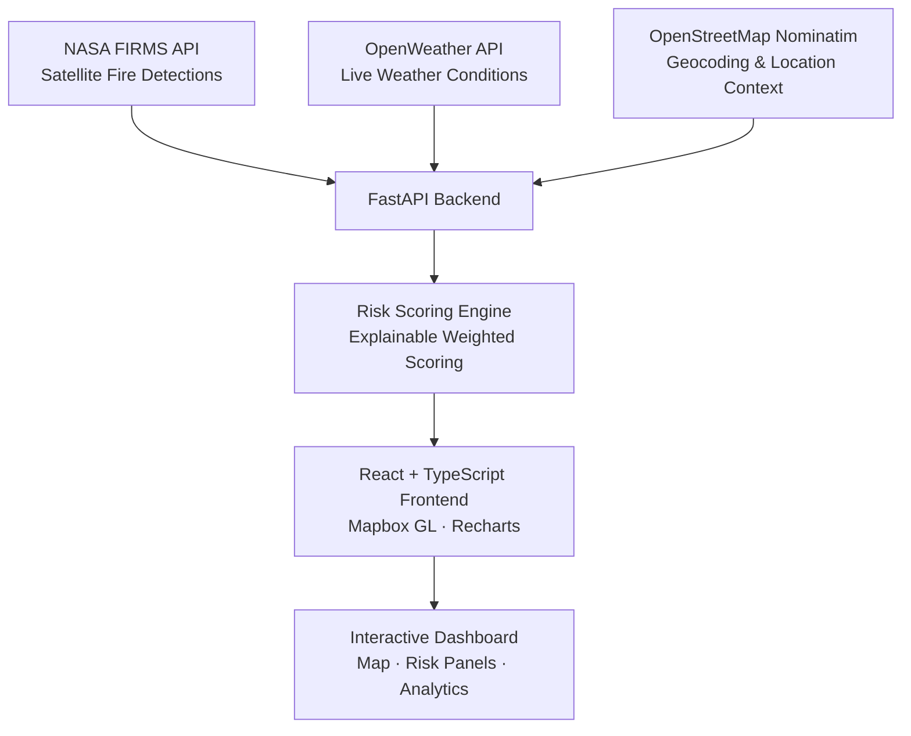

<div align="center">

# 🔥 EmberSight

### Wildfire Risk Intelligence Platform

EmberSight is a full-stack wildfire intelligence platform that fuses real-time satellite fire detections, live weather conditions, explainable risk scoring, spread projections, historical trend analysis, and community impact estimation into a single interactive dashboard — turning raw fire data into decision-ready intelligence.

<!-- Replace with real badges once CI/license/deployment are configured -->


</div>

---

## Table of Contents

- [Problem Statement](#problem-statement)
- [Key Features](#key-features)
- [Architecture](#architecture)
- [Technology Stack](#technology-stack)
- [Explainable Risk Engine](#explainable-risk-engine)
- [Screenshots](#screenshots)
- [Challenges & Engineering Decisions](#challenges--engineering-decisions)
- [Future Improvements](#future-improvements)
- [Getting Started](#getting-started)
- [Environment Variables](#environment-variables)
- [What This Project Demonstrates](#what-this-project-demonstrates)

---

## Problem Statement

Wildfires are detected, tracked, and reported on more aggressively than ever — satellite feeds, news alerts, and public hazard maps now surface fire activity within hours of ignition. Yet for the people who actually need to make decisions, that raw detection data is not enough.

**A dot on a map tells you a fire exists. It doesn't tell you whether it matters to you.**

- A fire detection without weather context can't indicate how fast conditions are likely to deteriorate.
- A map without historical context can't tell you whether a region is a recurring hot zone or an isolated anomaly.
- A point on a map without population or infrastructure context can't tell you who or what is actually at risk.

This is the gap between **tracking** and **intelligence**. Existing public tools largely solve tracking — plotting hotspots on a map. EmberSight is built to solve the harder problem: synthesizing fire, weather, geography, and historical patterns into a single, explainable risk signal that supports real decisions — for residents, local responders, and researchers — rather than just confirming that something is burning.

---

## Key Features

- **Real-time NASA FIRMS Integration** — Live satellite-based wildfire detections ingested directly from NASA's Fire Information for Resource Management System.
- **OpenWeather Integration** — Live temperature, humidity, and wind conditions layered onto every detected fire event.
- **Interactive Geospatial Visualization** — Map-based exploration of active fires with clustering, filtering, and location search.
- **Explainable Wildfire Risk Scoring** — A transparent, factor-by-factor risk score instead of an opaque black-box number.
- **Risk Forecasting** — Forward-looking risk trajectory based on current environmental trends.
- **Fire Details & Spread Projections** — Per-fire breakdown including detection confidence, intensity indicators, and projected spread direction.
- **Community Impact Estimation** — Contextualizes fire risk against nearby populated areas and infrastructure.
- **Historical Wildfire Analytics** — Trend views for understanding recurrence, seasonality, and regional risk patterns over time.
- **Responsive Dashboard UI** — A single-pane decision-support interface usable on desktop and mobile.

---

## Architecture



```
NASA FIRMS  ─┐
OpenWeather  ─┼──▶  FastAPI Backend  ──▶  Risk Scoring Engine  ──▶  React Frontend  ──▶  Interactive Dashboard
OSM Nominatim─┘
```

**Data flow:**

1. The FastAPI backend polls NASA FIRMS for active fire detections within configured regions and timeframes.
2. Each detection is enriched with live weather data from OpenWeather (temperature, humidity, wind speed/direction) at its coordinates.
3. OpenStreetMap Nominatim resolves coordinates into human-readable location context for search and display.
4. The Risk Scoring Engine combines fire and weather signals into a per-fire explainable risk score, exposing each contributing factor rather than a single opaque output.
5. The React frontend consumes the processed data via REST endpoints and renders it through Mapbox GL (geospatial layers) and Recharts (trend/analytics visualizations) inside the dashboard.

---

## Technology Stack

**Frontend**

| Technology | Purpose |
|---|---|
| React | Component-based UI architecture |
| TypeScript | Type safety across the frontend codebase |
| Tailwind CSS | Utility-first styling system |
| Mapbox GL | Interactive geospatial fire mapping |
| Recharts | Historical trend and analytics charts |

**Backend**

| Technology | Purpose |
|---|---|
| FastAPI | High-performance async API layer |
| Python | Data processing and risk scoring logic |

**External APIs**

| API | Purpose |
|---|---|
| NASA FIRMS | Real-time satellite wildfire detection data |
| OpenWeather | Live weather conditions per fire location |
| OpenStreetMap Nominatim | Reverse geocoding and location search |

---

## Explainable Risk Engine

Wildfire risk in EmberSight is calculated from four observable environmental factors:

- **Temperature** — Higher ambient temperatures dry out vegetation and accelerate combustion.
- **Humidity** — Lower relative humidity reduces fuel moisture, increasing ignition and spread likelihood.
- **Wind Speed** — Higher wind speeds drive faster fire spread and increase unpredictability.
- **Fire Density** — Clusters of nearby detections indicate a larger or more active fire front rather than an isolated event.

Each factor is normalized into a sub-score, then combined into a weighted composite risk score (0–100):

```
Risk Score = (w1 × temperature_factor)
           + (w2 × (100 − humidity))
           + (w3 × wind_factor)
           + (w4 × fire_density_factor)
```

**Why explainability over a black-box score:**

A single unexplained number is easy to build but hard to trust — especially when the decisions downstream involve personal or community safety. EmberSight deliberately uses a transparent, factor-weighted model instead of an opaque ML classifier so that:

- Every risk score can be traced back to the specific conditions that produced it.
- Users can see *why* a fire is rated high-risk (e.g., "low humidity + high wind"), not just *that* it is.
- The scoring logic can be audited, questioned, and adjusted as understanding of regional fire behavior improves.

Explainability was prioritized as a product requirement, not an afterthought — a risk platform people are meant to act on has to be inspectable, not just accurate.

---

## Screenshots

> Screenshots to be added as the project reaches feature completion.

### Homepage
<!--  -->
*Landing view with platform overview and live wildfire activity summary.*

### Dashboard
<!--  -->
*Primary interactive map showing real-time fire detections and risk overlays.*

### Fire Details Drawer
<!--  -->
*Per-fire breakdown including weather conditions, detection confidence, and spread projection.*

### Risk Analysis Panel
<!--  -->
*Factor-by-factor explainable risk score with historical trend context.*

---
## Live Demo
https://embersight.vercel.app

## Challenges & Engineering Decisions

**Integrating real-time wildfire data**
NASA FIRMS data updates on a polling cadence rather than a push model, and detection density varies enormously by region and season. The backend was designed around scheduled polling with caching, rather than naive on-demand calls, to keep the dashboard responsive without exceeding API limits.

**Handling geospatial data**
Dense fire clusters (common during active wildfire seasons) can overwhelm a map UI if rendered as raw points. Detections are clustered and viewport-scoped so the map stays legible and performant whether there are five active fires or five hundred.

**Balancing accuracy and explainability**
A more "accurate" black-box model was a viable option, but it would have made every risk score unverifiable. The weighted, factor-based scoring approach was chosen deliberately — it trades a marginal amount of theoretical predictive power for full transparency, which matters more in a tool meant to inform real decisions.

**API reliability and fallback handling**
Third-party APIs fail, rate-limit, or return partial data. The backend treats this as the default case, not the exception — falling back to last-known-good cached data and degrading gracefully (e.g., showing fire detections without weather enrichment) rather than failing the whole dashboard when one upstream source is unavailable.

**Designing a dashboard for decision support**
The UI is built around progressive disclosure: the map surfaces overall risk at a glance, while drilling into a specific fire reveals the full factor breakdown. This avoids overwhelming users with every data point at once while keeping detailed reasoning one click away.

---

## Future Improvements

- **Advanced Spread Simulation** — Model fire progression using wind-driven spread dynamics rather than static projection.
- **Evacuation Route Planning** — Integrate routing data to suggest safe egress paths away from active fire fronts.
- **Additional Data Sources** — Incorporate NOAA and GOES satellite feeds for cross-validated detection confidence.
- **Historical Fire Data Warehouse** — Build a time-series data store to support deeper longitudinal trend analysis.
- **Alert Subscriptions** — Allow users to subscribe to risk-threshold alerts for saved regions of interest.

---

## Getting Started

### 1. Clone the repository

```bash
git clone https://github.com/yourusername/embersight.git
cd embersight
```

### 2. Install frontend dependencies

```bash
cd frontend
npm install
```

### 3. Install backend dependencies

```bash
cd ../backend
python -m venv venv
source venv/bin/activate   # On Windows: venv\Scripts\activate
pip install -r requirements.txt
```

### 4. Create your `.env` file

```bash
cp .env.example .env
```

Then populate it with your own API keys (see [Environment Variables](#environment-variables)).

### 5. Run the backend

```bash
uvicorn main:app --reload
```

### 6. Run the frontend

```bash
cd ../frontend
npm run dev
```

The dashboard will be available at `http://localhost:5173` (or your configured port), with the API served at `http://localhost:8000`.

---

## Environment Variables

Create a `.env` file in the backend directory with the following keys:

```
FIRMS_MAP_KEY=YOUR_FIRMS_MAP_KEY
OPENWEATHER_API_KEY=YOUR_OPENWEATHER_API_KEY
```

---

## What This Project Demonstrates

- **Full-Stack Development** — A complete system spanning a typed React/TypeScript frontend and an async Python/FastAPI backend.
- **API Integration** — Consuming and reconciling multiple third-party real-time data sources (NASA FIRMS, OpenWeather, OSM Nominatim) into a coherent data layer.
- **Geospatial Visualization** — Rendering and interacting with map-based, location-aware data using Mapbox GL.
- **Data Engineering** — Designing polling, caching, and fallback strategies for unreliable real-time external data.
- **Product Design** — Structuring a dashboard around progressive disclosure to support real decision-making rather than just data display.
- **Explainable Analytics** — Choosing and implementing a transparent scoring methodology over a black-box model, and justifying that tradeoff explicitly.

---

## License

This project is licensed under the MIT License — see the [LICENSE](./LICENSE) file for details.

## Acknowledgments

- [NASA FIRMS](https://firms.modaps.eosdis.nasa.gov/) for real-time wildfire detection data.
- [OpenWeather](https://openweathermap.org/) for live meteorological data.
- [OpenStreetMap](https://www.openstreetmap.org/) contributors for geocoding data via Nominatim.
